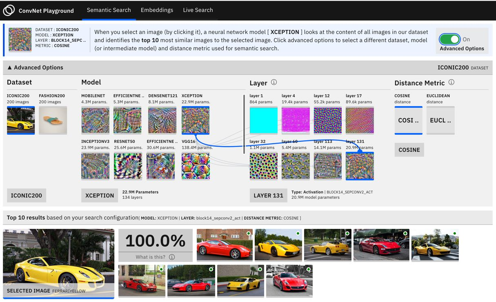
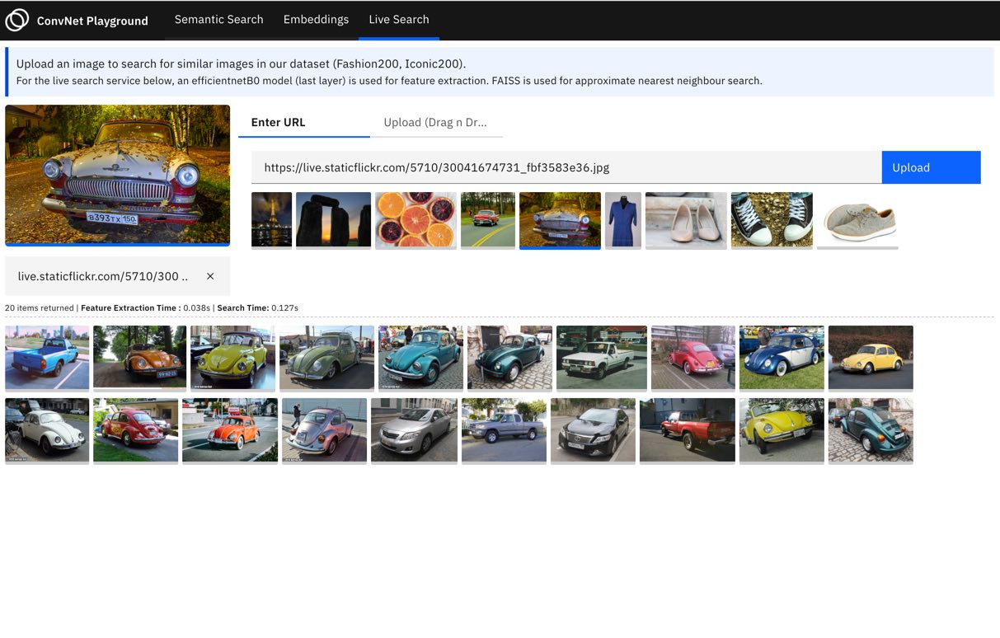

# Semantic Image Search with Convolutional Neural Networks

This repo explores how convolutional neural network models (e.g. [EfficientNets](https://arxiv.org/abs/1905.11946)) can be applied to the task of semantic search. It provides scripts for feature extraction, semantic search (image retrieval) and a front end application for visualizing search query performance across two datasets. This repo builds on content from the [Fast Forward Labs Report](https://www.cloudera.com/products/fast-forward-labs-research/fast-forward-labs-research-reports.html) on Deep Learning for Image Analysis. For an extended treatment of convolutional neural networks and their application to a variety of tasks (e.g. image classification, object detection, image generation etc.), please consult the report!



## Overview of Semantic Search

To enable semantic search applications, a few prerequisites steps are helpful.

- Extracting semantic representations: In this step, the goal is to construct numeric representations of data such that similar data items are numerically _similar_. In this project we use a pretrained convolutional neural network as a feature extractor for all items in the dataset.
- Similarity Search: Given a new image (search query), this task focuses on identifying the k most similar items in the dataset. As the size of the dataset increases (think millions of datapoints), it becomes computationally slow to compare search queries with the entire dataset. To address this, a set of scalable approximate nearest neighbour algorithms have been propossed. In this project, we use the [methods](https://arxiv.org/abs/1702.08734) implemented in the [FAISS](https://github.com/facebookresearch/faiss) package.

## Instructions

This repo provides scripts and examples that can help you get started with semantic search on your own dataset. The repo also provides a [tutorial](/notebooks/Semantic Image Search Tutorial.ipynb) notebook with visualizations that walks through the basics.
Repo structure and brief description of content is provided below:

    ├── app
    │   ├── backend      # flask app to serve search endpoint and web interface
    │   └── frontend     # code for front end app
    ├── cml
    │   └── create_index.py  # script to create a FAISS index from data
    ├── lib
    │   ├── extractor.py     # return representations for images, given a model
    │   ├── faissindex.py    # create, update, load, save a FAISS index + index id map
    │   └── model.py         # load and run predictions from a pretrained model

The following scripts are recommended as a starting point:

### Install dependencies

```shell
pip3 install -r requirements.txt
```

This repo depends on a few libraries (e.g. Tensorflow 2.0) that need to be installed.

### Create an index

```shell
python3 cml/create_index.py
```

This script scans a [data](app/frontend/build/assets/semsearch/datasets) directory for images, extracts features using a pretrained model ([EfficientNetsB0](https://arxiv.org/abs/1905.11946)) and adds each feature to an FAISS index which is then saved to disc.

### Launch the frontend app

```shell
python3 app/backend/app.py
```

This script launches a web application with several sections.

| Section                 | Description                                                                                                                                                                                                                                                                                                                                                                                                                                                                                                                                                   | View                                                              |
| ----------------------- | ------------------------------------------------------------------------------------------------------------------------------------------------------------------------------------------------------------------------------------------------------------------------------------------------------------------------------------------------------------------------------------------------------------------------------------------------------------------------------------------------------------------------------------------------------------- | ----------------------------------------------------------------- |
| Search Visualization    | In implementing a semantic search system, the data scientist/ml engineer needs to make several decisions. What model architecture is suitable for semantic feature extraction? Do I use the entire model or an intermediate model? What distance metrics work best (e.g. cosine, euclidean?). This section visualizes the precomputed results of multiple experiments that explore these choices (2 datasets, 9 model architectures, 8 intermediate models, 2 distance metrics) and allows the user to build intuition on how they affect search performance. |      |
| Embedding Visualization | One way to assess the suitability of representations methods with respect to the task of semantic search, is to visualize embeddings produced by the method. This section provides an interactive UMAP visualization of embeddings extracted from each image in two datasets across multiple model architecture choices.                                                                                                                                                                                                                                      |  |
| Live Search             | This section allows the user to perform live search using their own images (upload your own image or provide an image URL). It demonstrates how a feature extractor and approximate nearest neighbour search (FAISS) can be wrapped into a web endpoint to serve end user queries.                                                                                                                                                                                                                                                                            |  |

## Search on Your Own Data (At Scale)

A good starting point in adapting this repo to your own data is to modify the index creating script - [cml/create_index.py](cml/create_index.py). In this project, we build an index using a relatively [small dataset of 400 images](app/frontend/build/assets/semsearch/datasets) and use a dictionary persisted on disc to maintain a mapping between FAISS indices and image metadata (paths). With a larger dataset, a few changes are helpful:

- **Explore additional models for feature extraction**: For this specific task, we can explore a set of pretrained CNN models (see [Tensorflow 2.0 architectures with pretrained weights](https://www.tensorflow.org/api_docs/python/tf/keras/applications/)). Hint: we can even construct submodels (with fewer parameters, lower latency) for feature extraction and better relevance for similarity.

- **Parrallelized feature extraction pipeline**: Explore the use of tasks runners (e.g. Apache Airflow, Apache Beam) in designing a pipeline to i.) ingest images ii.) extract features iii.) Add each extracted feature to an FAISS. These can be run as scheduled batch jobs.

- **DBMS**: Use a full fledged DBMS (SQL or NoSQL) for maintaining mapping between FAISS indices and image metadata. Given that mappings are light weight structured strings, and ACID compliant implementations might be required, an SQL based DBMS is preferrable.

- **Distributed Index**: As data grows large, it becomes impractical to hold the entire index in memory. A straightforward approach to address this would be to use the [Distributed implementation of FAISS](https://github.com/facebookresearch/faiss/tree/master/benchs/distributed_ondisk). Optionally, a FAISS GPU implementation can be explored for improved index speed.
